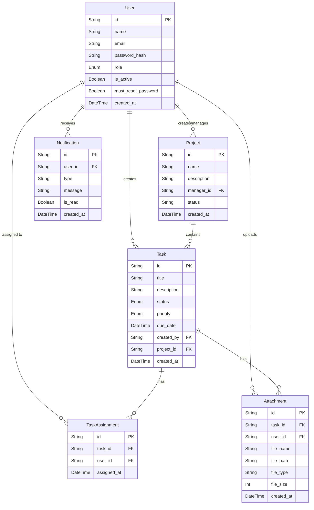
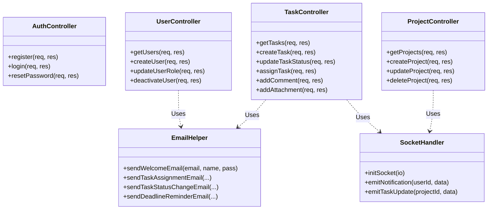

# Task Management System (TMS) - System Documentation

This document serves as the comprehensive technical documentation for the entire Task Management System. It covers system architecture, API details, database design, class diagrams, and deployment strategies.

---

## 1. System Architecture & Source Code Overview

The system follows a standard modern Client-Server architecture separated into a Frontend and a Backend.

### 1.1 Frontend (Client)
- **Framework:** React 19 built with Vite.
- **Routing:** React Router v7.
- **State Management & API:** React Context (for Authentication) and Axios (for API requests).
- **Real-Time:** `socket.io-client` listens for instant updates (task assignments, notifications).
- **Drag-and-Drop:** `@hello-pangea/dnd` handles Kanban board task status transitions.
- **Styling:** CSS Modules for scoped, modular styling.

### 1.2 Backend (Server)
- **Runtime:** Node.js (v25) & Express.js.
- **Architecture Pattern:** MVC (Model-View-Controller) structure.
  - `routes/`: Define REST API endpoints.
  - `controllers/`: Handle business logic.
  - `middleware/`: Handle JWT authentication (`authenticate.js`) and RBAC authorization (`authorize.js`).
  - `utils/`: Helpers like `emailHelper.js` (Nodemailer) and `deadlineChecker.js` (Cron jobs).
- **Database ORM:** Prisma Client.
- **Real-Time:** `socket.io` emits events to connected clients.
- **File Uploads:** `multer` parses multipart form data and saves files locally to `/uploads`.

---

## 2. Deployment Diagram

The following diagram illustrates how the system components communicate in a production environment.

```mermaid
graph TD
    User([User Browser])
    
    subgraph "AWS S3 Bucket (Frontend Layer)"
        ReactApp[React Application]
    end
    
    subgraph "AWS EC2 Instance (Backend Layer)"
        ExpressAPI[Express.js REST API]
        SocketServer[Socket.io Server]
        BackgroundWorker[Deadline Checker Cron]
    end
    
    subgraph "Database Layer (Supabase)"
        PostgreSQL[(PostgreSQL DB)]
    end
    
    subgraph "External Services"
        SMTP[SMTP Server / Gmail]
    end

    User <-->|HTTP / HTTPS| ReactApp
    ReactApp <-->|REST Requests| ExpressAPI
    ReactApp <-->|WebSockets| SocketServer
    
    ExpressAPI <-->|Prisma ORM (TCP)| PostgreSQL
    BackgroundWorker -->|Query| PostgreSQL
    
    ExpressAPI -->|Dispatch| SMTP
    BackgroundWorker -->|Dispatch| SMTP
    SMTP -->|Emails| User
```

---

## 3. Database Design & ER Diagram

The database is built on **PostgreSQL** and managed entirely via **Prisma**. 

### 3.1 Entity-Relationship (ER) Diagram



---

## 4. Class & Component Diagram

This diagram illustrates the core controller classes and utility services operating in the backend.



---

## 5. API Documentation

The backend exposes a comprehensive RESTful API. 
**Interactive Documentation:** The full OpenAPI (Swagger) specification is available interactively when running the backend server at:
👉 **`http://localhost:5000/api-docs`**

### Core Endpoint Summary

| Feature Area | Endpoint | Method | Description | Roles Allowed |
| :--- | :--- | :--- | :--- | :--- |
| **Auth** | `/api/auth/login` | `POST` | Authenticate user and issue JWT | Public |
| **Auth** | `/api/auth/reset-password` | `POST` | Reset forced temporary password | All Authenticated |
| **Users** | `/api/users` | `GET` | Retrieve list of users | Admin, Manager |
| **Users** | `/api/users` | `POST` | Create a new user account | Admin |
| **Users** | `/api/users/:id/role` | `PATCH` | Change a user's role | Admin |
| **Projects** | `/api/projects` | `GET` | List all available projects | All Authenticated |
| **Projects** | `/api/projects` | `POST` | Create a new project | Manager |
| **Tasks** | `/api/tasks` | `GET` | Get tasks (filtered by project/user) | All Authenticated |
| **Tasks** | `/api/tasks` | `POST` | Create a new task | Manager |
| **Tasks** | `/api/tasks/:id/status` | `PATCH` | Update task status (Drag & drop) | Manager, Collaborator |
| **Tasks** | `/api/tasks/:id/assign` | `POST` | Assign a user to a task | Manager |
| **Files** | `/api/tasks/:id/attachments`| `POST` | Upload a file (`multipart/form-data`) | All Authenticated |
| **Notifs** | `/api/notifications` | `GET` | Get user notifications | All Authenticated |
| **Dashboard**| `/api/dashboard/stats` | `GET` | Get aggregate KPI metrics | All Authenticated |

---

## 6. Security & Infrastructure Details

- **Authentication Protocol:** JSON Web Tokens (JWT) are signed with a secure secret (`JWT_SECRET`). Tokens are sent via the HTTP `Authorization: Bearer <token>` header.
- **CORS:** Cross-Origin Resource Sharing is strictly configured to only allow requests from the designated `FRONTEND_URL`.
- **Database Safety:** Prisma protects against SQL injection inherently. The Supabase connection relies on a secured connection pool.
- **File Storage:** Attachments are currently stored locally in the `backend/uploads/` directory. (Note: For horizontal scaling in production, this should be migrated to AWS S3 or a similar blob storage).
