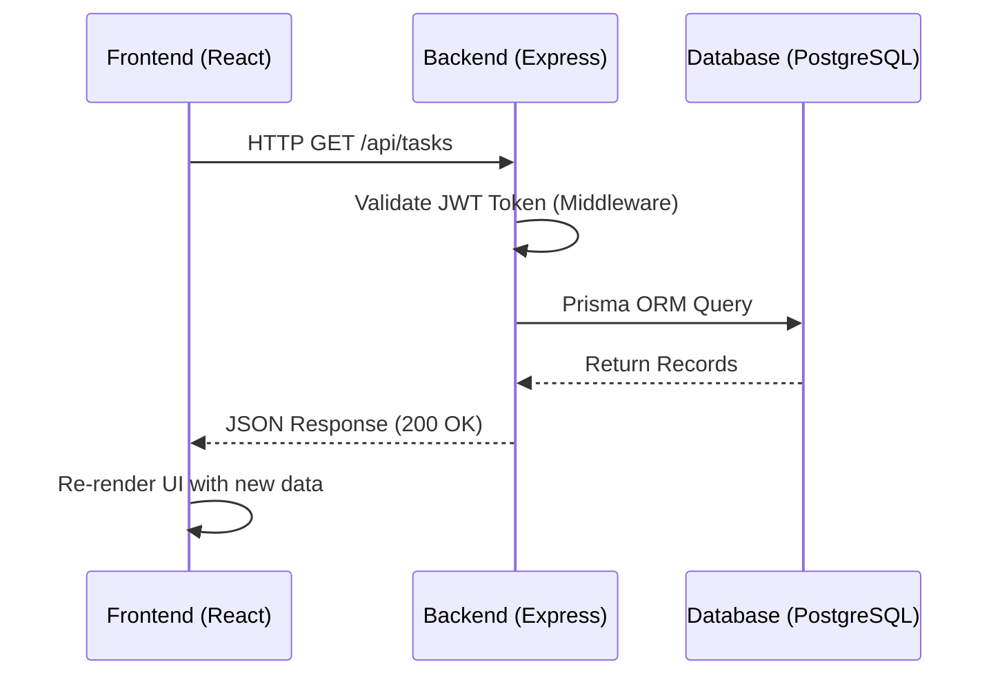
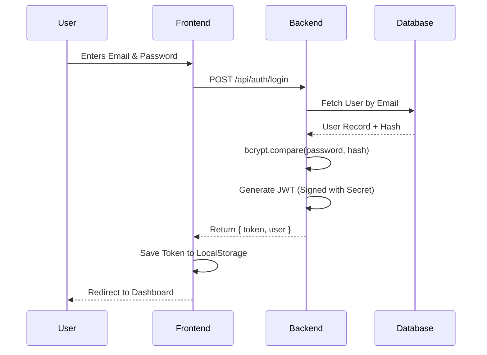
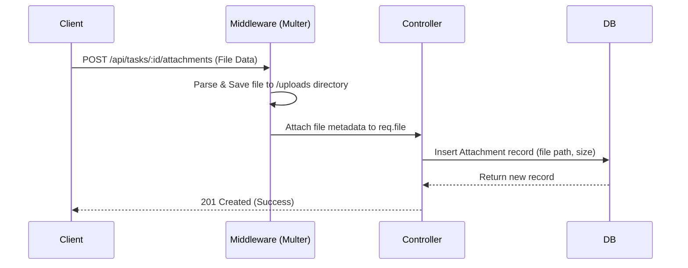
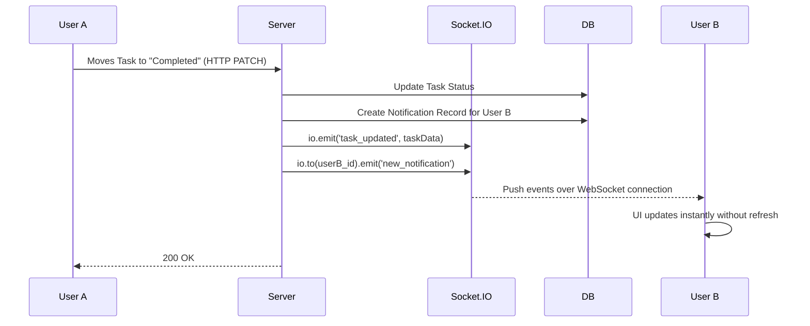

# Technical Explanation Document
**Project:** Task Management System (TMS)  
**Target Audience:** Presentation, Technical Interview, Viva Defense  

---

## 1. Project Overview

### What is the purpose of this system?
The Task Management System (TMS) is a full-stack web application designed to facilitate team collaboration, organize project workflows, and track task progression in real-time. It acts as a centralized hub where teams can manage their day-to-day operations seamlessly.

### What problem does it solve?
In modern work environments, teams often struggle with disorganized workflows, missed deadlines, fragmented communication, and lack of visibility into project status. This system solves these problems by:
1. Centralizing all tasks and projects into one digital workspace.
2. Automating deadline reminders and assignment notifications via email.
3. Providing real-time UI updates across all users so everyone is always looking at the most current data.

### Who are the users?
The system utilizes **Role-Based Access Control (RBAC)** to serve three distinct user types:
1. **Administrators:** IT/System admins who manage user accounts, roles, and overall system access.
2. **Project Managers:** Leaders who create projects, break them down into actionable tasks, assign them to team members, and monitor overall progress.
3. **Collaborators:** Team members who execute the work, update task statuses (via drag-and-drop), upload file attachments, and communicate via comments.

### Main features of the system
- **Secure Authentication:** JWT-based login with forced password resets for newly provisioned accounts.
- **Interactive Task Board:** A Kanban-style drag-and-drop interface for moving tasks between statuses (To Do, In Progress, Completed).
- **Real-Time Collaboration:** Instant UI updates and in-app notifications without requiring a page refresh.
- **Automated Emails:** Transactional email alerts for account creation, task assignments, and looming deadlines.
- **File Management:** Ability to upload and attach documents/images directly to tasks.
- **Interactive API Docs:** An integrated Swagger UI dashboard for testing backend endpoints.

---

## 2. System Architecture

The project follows a standard **N-Tier Client-Server Architecture**. The frontend handles presentation and user interaction, the backend handles business logic and security, and the database handles data persistence. 

- **Frontend:** Hosted statically (e.g., AWS S3).
- **Backend:** Hosted on a compute server (e.g., AWS EC2).
- **Database:** Hosted on a managed PostgreSQL service (e.g., Supabase).

### 2.1 Request-Response Flow (REST API)
Standard HTTP communication between the client and server.

### 2.2 Authentication Flow
A stateless authentication architecture using JSON Web Tokens (JWT).

### 2.3 File Upload Flow
Handling `multipart/form-data` for file attachments.

### 2.4 Real-Time Notification Flow
Using WebSockets to push updates to connected clients instantly.

---

## 3. Technology Stack

### Frontend Technologies

#### 1. React (v19)
- **Why chosen:** Component-based architecture allows for highly reusable UI elements. The Virtual DOM ensures efficient re-rendering when data changes.
- **Problem it solves:** Managing complex, dynamic UI states (like Kanban boards and real-time lists) natively in vanilla JavaScript is incredibly difficult.
- **Where used:** Entire frontend UI.
- **Alternatives:** Vue.js, Angular, Svelte.

#### 2. Vite
- **Why chosen:** Blazing fast Hot Module Replacement (HMR) and optimized esbuild compilation.
- **Problem it solves:** Replaces older bundlers like Webpack (Create React App), solving the problem of extremely slow development server startup times.
- **Where used:** Frontend build tool and development server.
- **Alternatives:** Webpack, Parcel, Turbopack.

#### 3. @hello-pangea/dnd
- **Why chosen:** A robust, actively maintained fork of `react-beautiful-dnd`.
- **Problem it solves:** Implementing fluid, accessible, and performant drag-and-drop interactions from scratch is highly complex due to browser inconsistencies.
- **Where used:** The Kanban Task Board interface.
- **Alternatives:** dnd-kit, react-dnd.

#### 4. Axios
- **Why chosen:** Automatically transforms JSON data, handles errors gracefully, and allows for global interceptors (e.g., automatically attaching the JWT token to every request).
- **Problem it solves:** Simplifies the native `fetch` API which requires manual JSON parsing and lacks built-in interceptors.
- **Where used:** All frontend API calls.
- **Alternatives:** Native `fetch()`, React Query (often used alongside Axios).

---

### Backend Technologies

#### 5. Node.js & Express.js
- **Why chosen:** Allows the use of JavaScript across the entire stack. Node.js uses an asynchronous, event-driven architecture that is highly efficient for handling numerous concurrent connections (like WebSockets). Express is lightweight, unopinionated, and easy to structure.
- **Problem it solves:** Provides a fast, scalable web server to expose REST APIs.
- **Where used:** The core backend application server.
- **Alternatives:** Python (Django/FastAPI), Java (Spring Boot), Go, Ruby on Rails.

#### 6. PostgreSQL
- **Why chosen:** The most advanced open-source relational database. Offers strict data integrity, foreign key constraints, and high performance.
- **Problem it solves:** Reliable, ACID-compliant storage for structured application data (Users, Tasks, Projects).
- **Where used:** The main database (hosted via Supabase).
- **Alternatives:** MySQL, MongoDB (NoSQL).

#### 7. Prisma ORM
- **Why chosen:** Generates a highly intuitive, type-safe query builder based on a readable schema file. Automatically handles database migrations.
- **Problem it solves:** Solves the pain of writing manual, error-prone SQL queries, and is much easier to debug than traditional ORMs like Sequelize.
- **Where used:** Backend data access layer.
- **Alternatives:** Sequelize, TypeORM, Drizzle, raw SQL queries.

#### 8. Socket.io
- **Why chosen:** Provides bi-directional, real-time communication. If WebSockets are blocked by a firewall, it automatically falls back to HTTP long-polling.
- **Problem it solves:** Eliminates the need for the frontend to constantly "poll" (repeatedly ask) the server for updates, drastically saving bandwidth and providing instant feedback.
- **Where used:** Real-time task board updates and live notification bells.
- **Alternatives:** Native WebSockets, Pusher, AWS API Gateway WebSockets.

#### 9. JSON Web Tokens (JWT) & bcrypt
- **Why chosen:** JWT provides a "stateless" authentication mechanism. `bcrypt` provides slow cryptographic hashing to prevent brute-force attacks on passwords.
- **Problem it solves:** Secures API routes without needing to store session IDs in the server's memory or database.
- **Where used:** Backend authentication controller and middleware.
- **Alternatives:** Session/Cookies (Passport.js), OAuth 2.0.

#### 10. Nodemailer
- **Why chosen:** The industry standard for sending emails in Node.js.
- **Problem it solves:** Automating transactional communication via an external SMTP server.
- **Where used:** Sending welcome emails with passwords, and task deadline reminders.
- **Alternatives:** SendGrid API, Resend, AWS SES.

#### 11. Multer
- **Why chosen:** The go-to Express middleware for handling `multipart/form-data`.
- **Problem it solves:** Allows the Express server to parse binary file uploads coming from the client and save them to the disk.
- **Where used:** Task file attachments route.
- **Alternatives:** Formidable, Busboy.

#### 12. Swagger UI (`swagger-ui-express` & `swagger-jsdoc`)
- **Why chosen:** Generates a standardized OpenAPI interface dynamically from code comments.
- **Problem it solves:** Solves the problem of outdated or disconnected API documentation by keeping the documentation directly next to the code.
- **Where used:** The `/api-docs` endpoint on the backend.
- **Alternatives:** Postman Collections, ReadMe.io, manual Markdown files.
